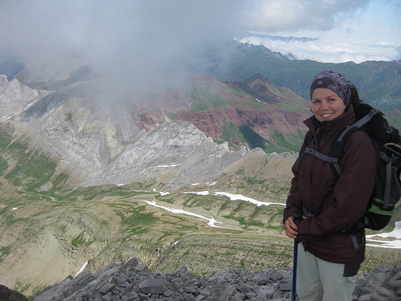

# Equiparse: Ropa de abrigo y chubasquero (15 de 34)

En alta montaña es imprescindible **llevar siempre, incluso en verano, prendas que protejan del frío, del agua y del viento**.

Las oscilaciones térmicas a esas alturas son siempre importantes, incluso en verano, y resulta muy fácil que la Isoterma cero se sitúe en algún momento del día o de la noche por debajo de la cota máxima de la excursión.  

**Una persona puede sobrevivir semanas sin alimento, días sin agua pero sólo unas horas sometido sin protección a una temperatura ambiente baja.**

La combinación de viento y frío puede ser peligrosa, a eso remite el **concepto de "sensación térmica"**, usado en los partes de la AEMET. Con temperaturas cercanas a cero, un viento fuerte puede producir congelaciones severas en muy poco tiempo. Disponer de prendas cortavientos puede salvarnos de hipotermias severas y evitar generar un rescate.

En cuanto a la ropa de abrigo, **varias capas de ropa funcionarán mejor que una prenda de abrigo muy gruesa**, y mediante el sistema de cebolla -poner y quitar capas- se podrá regular bien la ropa que necesitamos llevar.

**Materiales sintéticos funcionan mejor que los naturales**, pues no absorben el sudor y nos mantienen secos, aunque si son naturales también cabe la posibilidad de llevar siempre ropa de repuesto.  

El **impermeable tiene también la función de cortavientos**, imprescindible para protegernos de sentir más frío del que marca el termómetro (sensación térmica).  

Unos **guantes finos** tendrán siempre su hueco en la mochila: temperaturas bajo cero nos pueden sorprender más de una vez en verano en la alta montaña.  

Y recordad: ¡las primeras **nevadas** en el Pirineo siempre suelen caer en el mes de **agosto**!  

