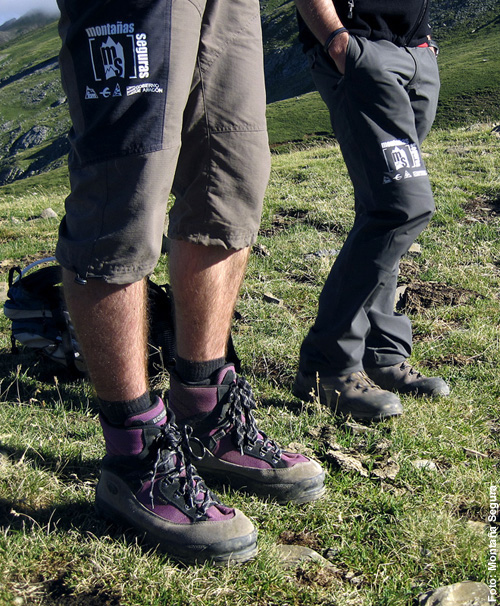

# Equiparse: Calzado (16 de 34)

Para caminar en alta montaña **no** valdrá cualquier tipo de calzado. Será imprescindible uno que cumpla las siguientes características:  

**1.** Una **suela rígida o semirrígida, con buen agarre y dibujo** para evitar resbalones y dolores en la planta del pie  
**2.** **Bota de caña alta para llevar el tobillo protegido**, pues suele ser habitual en esos medios que una piedra salte o darse un golpe en el tobillo con un saliente  

**3.** Que tengan un **tratamiento que les dé impermeabilidad**  

**4\.** Que tengan **protección en la parte frontal de los dedos**

**5\.** Que permitan **adaptar un crampón** (en caso de pasos por nieve seguros o probables)

Es recomendable también elegir unos **calcetines** apropiados y llevar un recambio que permita mantener secos los pies.  

Como **montañeros**, debéis escoger un calzado adecuado para la actividad.  

