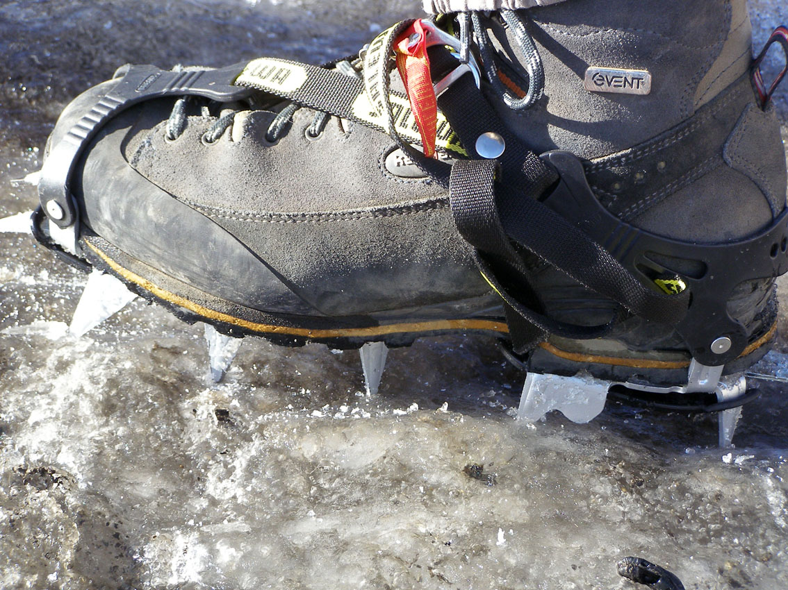

# Equipa: Preparados para la nieve: otro material técnico (18 de 34)

Si en la excursión planificada **hay que pisar nieve ello exige a cada montañero llevar en su equipo personal el material adecuado: piolet y crampones**, así como tener formación y experiencia en su manejo.

Muchos rescates en nieve se producen cuando un tropezón o el cansancio provocan una caída sobre la nieve y la falta de material y experiencia impiden que el montañero se auto detenga, así que ¡buen equipo y formación pueden salvar vidas!

El **piolet** es una herramienta de montaña que permite **auto detener una caída con deslizamiento incontrolado** en la nieve. Forma parte del equipo personal: **un piolet por cada miembro del grupo**. Sólo si se está seguro al 100% de que uno no se va a caer puede valorar dejarlo en casa, pero ¿quién puede estar seguro de eso?

Y aún así, **no basta con llevarlo para ser un montañero seguro**, lo importante es... **¡Saber utilizarlo, claro!** Para aprender a usar bien el piolet deberá tenerse formación y haber practicado en un lugar seguro. Para formarse puede recurrirse a los **cursillos** de los clubes de montaña o a los **guía de montaña.**

Los **crampones** son unos dispositivos metálicos y puntiagudos que se acoplan a las **botas** y **mejoran la adherencia en terrenos nevados o helados**. Forma parte del equipo personal: **un par de crampones por cada miembro del grupo.** Como el piolet, no basta con llevarlos para ser un montañero seguro, **lo importante es... **¡Saber utilizarlos!****

