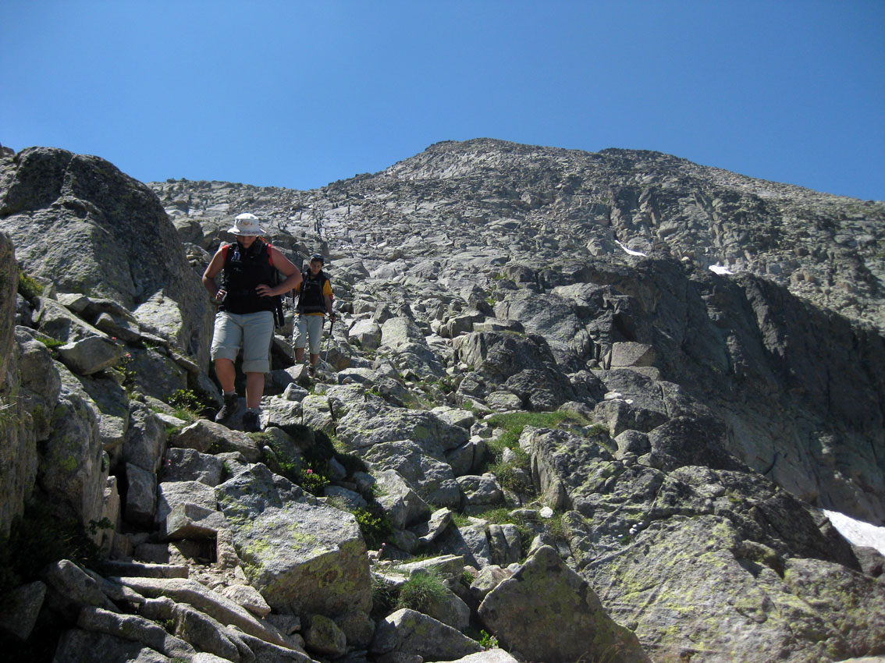

# Actúa: Valorar el Grupo (27 de 34)

Cada persona es... un mundo. Como **federado**, conviene recordar que **la capacidad de progresión del grupo será siempre la misma que lleve el elemento más débil** (menores, personas con menos experiencia, etc...)

Con el fin de que **todo el grupo se sienta con voz y voto en las decisiones que se toman**, involúcra al resto de participantes en la preparacion de la ruta. De esta manera será más fácil que luego ellos se animen a decirte cómo se encuentran y si van a poder realizar el recorrido de manera segura.

