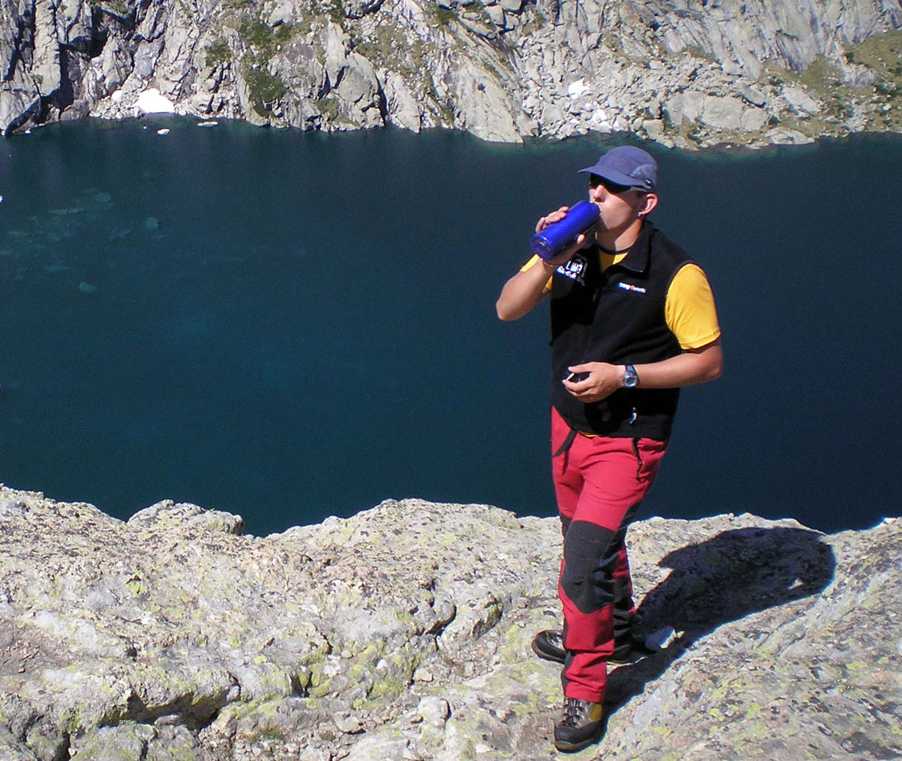

# Actúa: Beber, comer y protegerse del sol (30 de 34)

El ejercicio físico y el contacto con el medio aumentan el metabolismo y será necesario un mayor aporte de agua y de energía.

El sol da calor y luz pero también radiaciones que pueden dañar la piel y los ojos.

El medio natural nos sitúa frente a las **agresiones** que actúan sobre nosotros conjuntamente (cambios de temperatura, exposición al sol, trabajo muscular...).

En la **montaña** y con la **altura** se acentúan estos factores. Se necesita más protección, hidratación y energía. Con la **altitud**  disminuye  la **densidad del aire**, reduciéndose la presencia de oxígeno por lo que el **esfuerzo** necesario es mayor. También aumenta la **radiación solar**.

El **sol** puede ser un silencioso enemigo que estropee la jornada provocando insolaciones, quemaduras y problemas de visión. Hay que llevar siempre **gafas de sol**, cubrir y **proteger** **la piel**.

También conviene recordar que los paisajes o el entorno claro (roca caliza, nieve, masas de agua...) tienen un **efecto espejo** que multiplica la radiación solar.  

