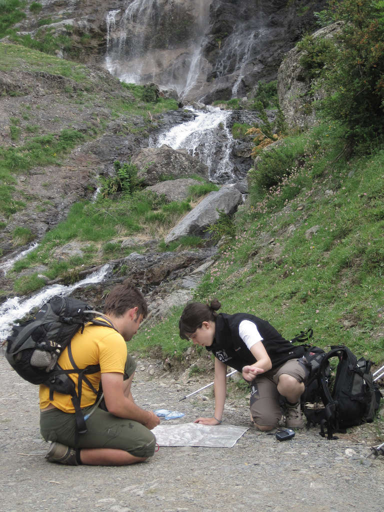

# Actúa: Usar los mapas y comprobar horarios (31 de 34)

El **mapa y la brújula son insustituibles para orientarse en el medio**, como **federados** debéis familiarizaros con ellos usandolos. Además, para moverse **en alta montaña será siempre imprescindible tener buen manejo de ellos, pues la correcta interpretación del itinerario muchas veces depende de la correcta interpretación del mapa,** al carecer el terreno de señalización explícita.

El GPS puede ser un buen complemento de los anteriores, pero debemos intentar que nunca dependan sólo de él pues puede fallar la calidad de la señal, apagarse o romperse.

**Uno de los problemas que más a menudo ocurre es que nunca se ha visto un mapa ni se sabe utilizarlo**. Para evitar esto es necesario ir **educandose** en la lectura de mapas, y ello empieza diseñando los recorridos **SOBRE** un mapa y familiarizandonos con los diferentes elementos.  

