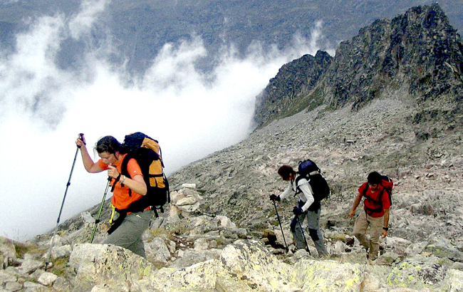

# Actúa: Comprobar la meteorología (32 de 34)

Debemos recordar que durante el recorrido conviene comprobar la evolución de la meteorología pues, a pesar de lo que digan las previsiones, ésta puede empeorar o variar. 

Hoy la información disponible es bastante fiable pero las variaciones a nivel local pueden ser importantes.

En **alta montaña**, no hacer caso a la meteorología puede generar estos problemas inesperados:

**1.** Tener que caminar **sobre firme mojado y resbaladizo**, lo que reducirá la velocidad de la marcha y aumentará el cansancio  
**2\. Mojarse** los pies y el resto del cuerpo, con las incomodidades que ello supone en una ruta larga y riesgos de hipotermia  
**3.** Tener **problemas de visión** por el viento o la radiación solar. **4\.** Sufrir **deshidratació****n** por el calor  
**5.** Pasar  mucho **frío**  
**6.** **Exponerse a una caída de rayo** en una situación de tormenta con aparato eléctrico

**En la montaña:  
**

*   Las **variaciones meteorológicas** (temperatura, viento, humedad) pueden ser muy **repentinas y** **acusadas**
*   Hay una menor **densidad del aire** (menos cantidad de oxígeno) y la **radiación solar** es mayor

