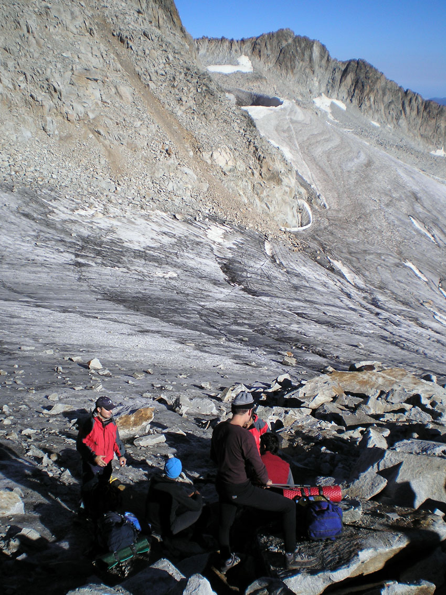

# Actúa: Usar piolet y crampones (33 de 34)

Hay que recordar que **debemos utilizar el material técnico siempre que haga falta**.

**Siempre que nos desplacemos sobre la nieve o el hielo debemos llevar** **el piolet en la mano**.

**El piolet** es una herramienta que sirve para **auto detener una caída** en esos medios pero, para que nos sea útil, hay que conocer su **técnica de uso**. De otra manera, llevarlo no sirve de nada.

Cuando el grupo llegue a la nieve, debemos dedicar unos minutos a repasar cómo hay que actuar en el caso de que se produzca una caída o tropiezo que les precipite pendiente abajo: ¡**el piolet puede salvarnos la vida!**

En el momento en que se considere que **caminar con los crampones puestos va a hacer más seguro el paso, **deben ponerse los crampones**.** Hay que asegurarse de que están correctamente colocados y **perfectamente** **ajustados** a la bota, de otra manera pueden provocar un tropiezo o una caída

