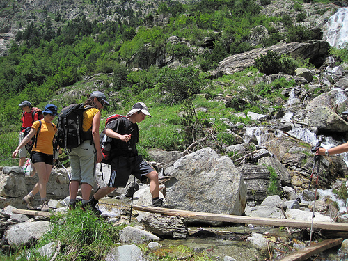

# Planifica: algunos factores a tener en cuenta para una correcta elección del itinerario (4 de 34)

Estos son los **factores a tener en cuenta,** no los olvides:  

1. La**experiencia**y el hábito en la alta montaña de todo el grupo y del líder en especial

2\. La**edad, forma física y motivación** de los miembros del grupo

3\. Las **condiciones de la ruta en el momento actual** y la **previsión del tiempo** para esos días

