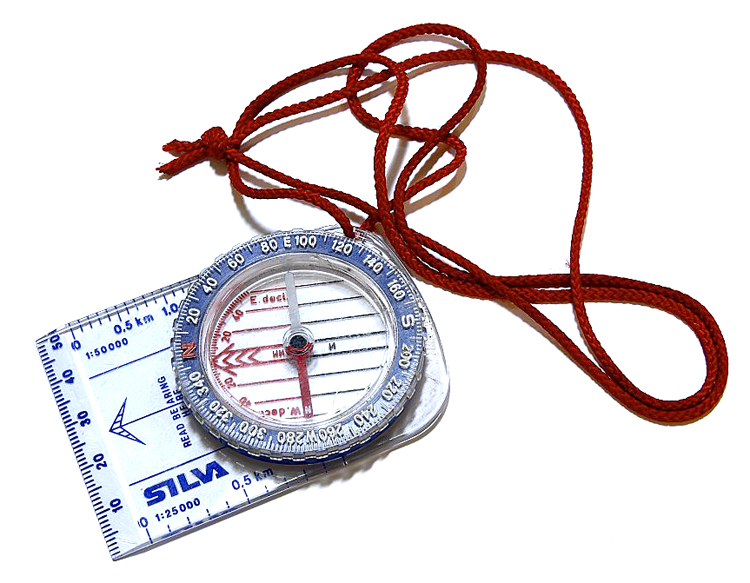

# Planifica: ¿Dónde Informarse? (5 de 34)  

Como **federado** y montañéro seguro que conoces a grandes rasgos muchas de las conocerás **características técnicas** de los **recorridos de alta montaña** más habituales. Sin embargo también es posible que necesites completar algunos datos o remitir a otros montañeros a a que busquen esa información.  

Para recorridos de alta montaña no suele haber mucha información, y deberás ir a fuentes especializadas del tipo:  

**A. Libros y guías especializados**  

**B. Internet**  

Internet tendrá mucha información, pero **para actividades de alta montaña tendrás muy poca "información oficial"** y mucha "información de usuario" (blogs), que siempre conviene tomar con pinzas a no ser que se "conozca bien" el nivel del "bloggero"  

Algunas Webs de referencia que os proponemos son:

**\- [Montaña Segura](http://www.montanasegura.com/) **(donde dispones de los folletos de recorridos y los tracks de muchas excursiones)  

**\- [Web de Albergues y Refugios de Aragón](http://www.alberguesyrefugiosdearagon.com/seguridad.php),** en su sección de "estado de las rutas", pues en ella hay información de las ascensiones más habituales desde los refugios y el estado de las mismas (información aportada por los guardas de los refugios)

