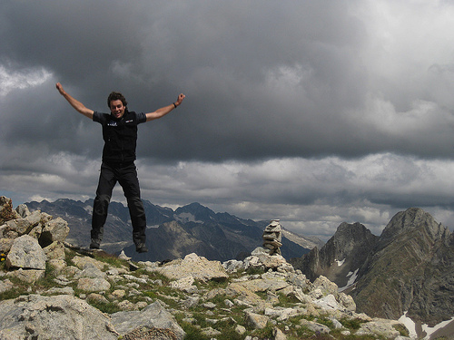

# Planifica: Consulta el tiempo (8 de 34)

Conocer la **previsión meteorológica** es fundamental para asegurar una buena excursión.

El **tiempo puede ser muy cambiante y variar mucho en el mismo día,** sobre todo en alta montaña: allí debemos prever siempre posibilidad de lluvia, viento  y de descensos bruscos de la temperatura.

Recordad que la web de la[**Agencia Estatal de Meteorología**](http://www.aemet.es/es/eltiempo/prediccion/montana)es una de las fuentes fiables para conocer la**previsión del tiempo**. En ellaencontrarás la predicción para **zonas de montaña**, que  es la que contempla con mayor detalle sus particularidades.  

Como **federado**, deberías consultar la previsión meteorológica antes de  cualquier actividad de montaña. Recuerda que **el parte se actualiza diariamente a las 15:00 horas.**  

El **tiempo previsto debería condicionar la elección del itinerario**.  
  

